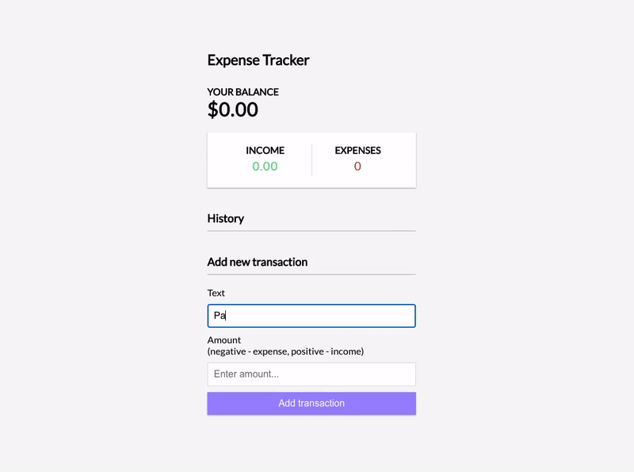

# Expense Tracker App

This project was bootstrapped with [Create React App](https://github.com/facebook/create-react-app).

### Demo

Online deployment of this project is available at [Expense Tracker App](https://expense-tracker-react-three.vercel.app/).

### Features

Keep track of income and expenses. Add and remove items.
### Technologies

React, Context Api

### Available Scripts

In the project directory, you can run:

### `npm start`

Runs the app in the development mode.\
Open [http://localhost:3000](http://localhost:3000) to view it in your browser.

The page will reload when you make changes.\
You may also see any lint errors in the console.

### `npm run build`

Builds the app for production to the `build` folder.\
It correctly bundles React in production mode and optimizes the build for the best performance.

